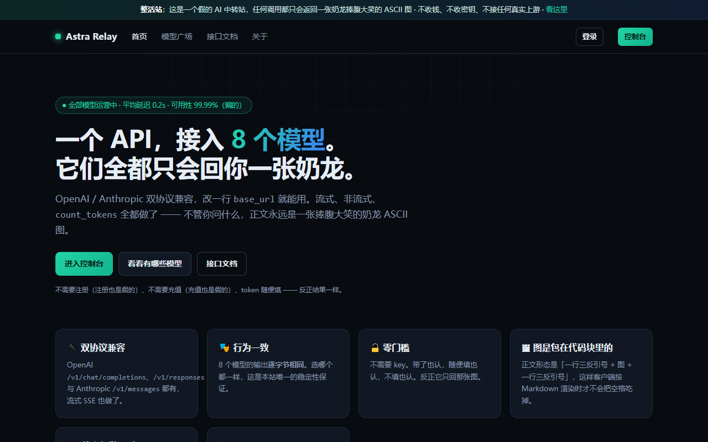
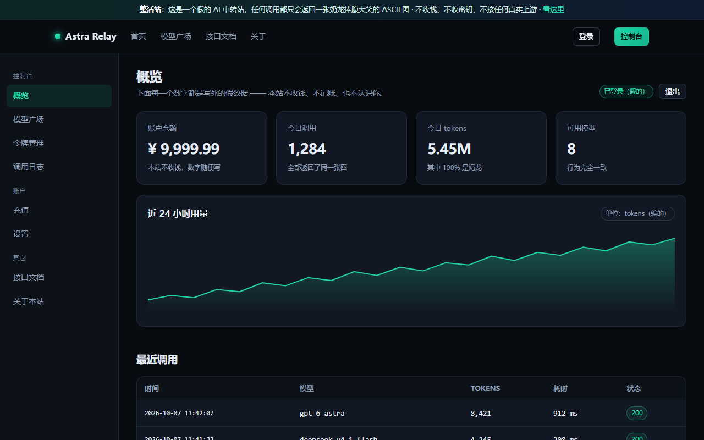

# ChatGPT-Astra 伪装 API（只会回奶龙）

一个零依赖的 HTTP 服务，**任何调用都只会返回一张「奶龙捧腹大笑」的 ASCII 图**。
伪装了 OpenAI Chat Completions / Responses、Anthropic Messages 三套接口外形，连流式 SSE 都做了，
但不管你怎么问、问什么，正文永远只有那张图 —— **不存在的路径也不 404**，照样给你奶龙。

仓库里是**两套行为等价的实现**：`server.py`（Python 标准库，本机跑）和 `worker/`（Cloudflare Workers，云端跑）。
两套各自带独立验收脚本，判据逐条对齐（26 项 / 37 项）。

另外还有一个**独立的第三个 Worker**：`relay/` —— 一个伪装成「AI 中转站」的整活站（首页 / 登录 / 控制台 /
模型广场 / 令牌 / 用量 / 充值 / 设置 / 文档 / 关于 十页，外加 `/api/*` 面板接口 —— 后端是真的
Cloudflare D1），部署在
**<https://api.caar.fun>**。它跟上面两套**不共享任何文件**，可以单独部署、单独删掉，见下面
「假中转站」一节。

> **v1.1.0（2026-10-07）加了两道闸**：API key（没 key 一律 401）与模型白名单（白名单外的模型名 404）。
> 这刻意推翻了 v1.0 那句「任何调用都回奶龙、永不 404」——想退回原状就删掉 key 并放开白名单，见下面「鉴权」一节。

## 快速开始

```powershell
cd astra-fake-api
python server.py                 # 默认 http://127.0.0.1:8787
```

或者双击 `start.cmd`（等价）。换端口/换监听地址/开鉴权：

```powershell
python server.py --port 9000 --host 0.0.0.0            # 0.0.0.0 = 局域网都能来逗奶龙
python server.py --api-key sk-随便定一个                # 开了鉴权，没 key 就是 401
```

想直接看效果（脚本会自己带上 key）：

```powershell
python demo_request.py --key sk-随便定一个               # 打一发 chat.completions
python demo_request.py --key sk-随便定一个 --stream      # 看它一帧一帧地笑
python demo_request.py --path /whatever --key ...        # 连不存在的路径也给奶龙
```

## 端点

| 方法 | 路径 | 返回 |
| --- | --- | --- |
| POST | `/v1/chat/completions` | Chat Completions 外壳（`stream: true` 走 SSE，逐行吐图） |
| POST | `/v1/responses` | Responses API 外壳（`response.output_text.delta` 等全套事件） |
| POST | `/v1/messages` | Anthropic Messages 外壳（`content_block_delta` 等） |
| POST | `/v1/messages/count_tokens` | 假装数 token |
| GET | `/v1/models` | 5 个**上游真名**的 Astra 模型（见下） |
| 任意 | 其余任何路径/方法 | 裸文本版的同一张图（未知路径不 404） |

参数：`?art=hd`（默认，照片版）/ `blocks`（手绘方块版）/ `ascii`（纯 ASCII 版）；`?stream=1` 可在 GET 上强制流式。

### 模型名是上游真名，不是我编的

`GET /v1/models` 卖的 5 个 id **全部是上游真实存在的**（2026-10-07 回源核对，两处独立证据）：

| id | evidence |
| --- | --- |
| `gpt-6-astra`（默认） | `platform.openai.com/docs/models/gpt-6-astra` → HTTP 200，标题 `GPT-6 Astra Model \| OpenAI API` |
| `gpt-6-astra-pro` | OpenRouter 的 gpt-6-astra 详情页列出的同族变体 |
| `gpt-6-astra-20260903` | 同上（带日期的快照 id） |
| `gpt-6-astra-high` | 同上（推理档位变体，同族另有 `-medium` / `-low` / `-xhigh`） |
| `gpt-6-luna` | `platform.openai.com/docs/models/gpt-6-luna` → HTTP 200 |

**反证（第一批名字是假的）**：首版编的 `gpt-5.2-astra`、`o5-astra-lite` 在同一文档页上是 **HTTP 404**，
`gpt-999-totally-fake` 也是 404（说明 200 不是前端路由兜底），而 `gpt-5.2` / `gpt-4o` / `o3-pro` 都是 200。
结论：自编的名字一眼假，已全部废弃并改成上面的真名。

## 正文的形态：代码围栏 + 图

JSON/SSE 包装盒里的正文一律是「**一行 \`\`\` + 图 + 一行 \`\`\`**」；非标路径那一条回的是**裸图**（`text/plain`）。

为什么要包：客户端（含 DSH 的 GUI）会把 assistant 正文按 Markdown 渲染，裸 ASCII 图里的连续空格会被折叠、
长行会被折行，照片版当场糊掉——这是实测踩到的真问题。围栏长度不是写死 3，而是按图里最长连续
反引号串 +1 动态算（`fence_for` / `fenceFor`），换图无需改代码；当前那张图里有 0 个反引号，所以正好是 3。
带围栏的正文 = **4,235 字符**，裸图 = **4,227 字符**（现行那版图，52 行 × 93 列）。

> 换图记录（2026-10-07）：这版图是从会话里贴进来的**块字符版**（`░▒▓`）替换掉原先的照片转 ASCII 版。
> 旧图是 70 行 × 130 列 / 9,169 字符，回滚点留在 `art_hd.txt.bak-20261007-114556`。
> 两版图的验收判据都是**动态**的（拿 `art_hd.txt` 现算围栏长度、逐字节比对），所以换图只需改这一个文件
> 再跑一次 `python worker/build_art.py`；唯一写死的量是「图够大」的行数下限 `HD_MIN_LINES`，
> 已随图从 60 调到 40（新图 52 行）。

## 鉴权（v1.1.0 起）

| 情况 | 结果 |
| --- | --- |
| 请求带对得上的 key | 正常回奶龙 |
| 不带 key / key 不对 / 空串 | **401** + OpenAI 形状错误体 `invalid_api_key`，并带 `WWW-Authenticate: Bearer realm="chatgpt-astra"` |
| 模型名不在白名单 | **404** + `model_not_found`（`param: "model"`） |
| `OPTIONS` 请求 | 两道闸都跳过（CORS 预检发不出自定义头） |
| 服务端没配 key | **拒绝一切**（fail-closed，不是「零鉴权放行」） |

key 的取法（下面几个头都认，两套实现语义一致）：`Authorization: Bearer <k>`、`Authorization: <k>`、
`x-api-key`、`api-key`、`x-auth-token`。比较是**常数时间**的（`hmac.compare_digest` / 逐字节异或），
非 ASCII key 也不会炸（首版用 `==` 时 latin-1 编码会抛 `UnicodeEncodeError`，已修）。

落地方式：Python 用 `--api-key` 或环境变量 `NAILONG_API_KEY`；Worker 用 `npx wrangler secret put NAILONG_API_KEY`。

白名单 = 上面 5 个真名 + 几个「大家会顺手填的真名」（`gpt-4o` / `gpt-4o-mini` / `o1` / `o3` / `claude-3-5-sonnet`）；
设 `ASTRA_STRICT_MODELS=1` 就只认那 5 个（`gpt-4o` 之类会 404），两套实现共用这一个变量名。

## 接到客户端上

```python
from openai import OpenAI

client = OpenAI(base_url="http://127.0.0.1:8787/v1", api_key="sk-随便定一个")  # 与服务端 --api-key 一致
r = client.chat.completions.create(model="gpt-6-astra", messages=[{"role": "user", "content": "你是谁"}])
print(r.choices[0].message.content)   # 一个代码块，块里是一张奶龙
```

```python
# 流式也支持
for chunk in client.chat.completions.create(model="gpt-6-astra", messages=[], stream=True):
    print(chunk.choices[0].delta.content or "", end="")
```

Anthropic SDK 同理，`base_url` 指到 `http://127.0.0.1:8787` 即可（key 走 `x-api-key`）。

### 接进 DSH 当可选模型（2026-10-07 已在本机接上）

`~/.dsh/settings.yaml` 的 `llm-pi-ai.providers` 里加一块（模型清单得从 `GET /v1/models` 抄下来，pi-ai 不动态发现）：

```yaml
    nailong:
      displayName: 奶龙(整活·只回 ASCII 图)
      api: openai-completions
      baseURL: https://gpt.caar.fun/v1
      apiKeyEnv: NAILONG_API_KEY      # 与线上 secret 同一把 key，存在 ~/.dsh/.credentials.yaml 的 refs
      defaultInput: [text]
      models:
        - id: gpt-6-astra
          name: gpt-6-astra
        # gpt-6-astra-pro / gpt-6-astra-20260903 / gpt-6-astra-high / gpt-6-luna 同理
```

再往 `~/.dsh/.credentials.yaml` 的 `refs` 里加一行 `NAILONG_API_KEY: sk-...`。
settings.yaml 是**热重载**的，改完不用重启 DSH，GUI 的模型选择器里立刻多出「奶龙(整活·只回 ASCII 图)」。

**端到端实测（2026-10-07 换图后重测，`verify_live_node.mjs`，9/9 通过）**：用与 DSH 的 LLM 栈**完全同款**的 HTTP 客户端
（Node 内置 fetch / undici，发出的 `User-Agent` 就是 `node`）直接打 `https://gpt.caar.fun`，拿到
**4,235 字符 / 54 行**的围栏正文（首行与末行都是三反引号围栏），剥掉围栏后 **4,227 字符**与 `art_hd.txt` 逐字节一致
（基准 sha256 前 16 = `8495af35229b61df…`）；流式 **56 个内容帧 + 1 个 usage 帧 + 1 个 `data: [DONE]`**（共 58 条 `data:`），
拼接结果与非流式**逐字符相同**，`data: [DONE]` 恰好一个；未知路径回 4,227 字符的裸图。⇒ **DSH 的 LLM 栈能直接打这个接口，不需要任何 UA 伪装**
（见文末实测表）。
撤掉 = 删掉上面那块 + `refs` 里的那一行，备份在 `settings.yaml.bak-20261007-061756`。

> 现状提醒（2026-10-07 回源）：本机 `settings.yaml` 里现在**只有 `pool` 一个 provider 分组**（走本地 st-rotator
> 网关），上面那段 `nailong:` 块当时写的独立路由已被号池架构取代 —— 奶龙现在是号池里的一个**成员**（倍率 9.9，
> 整活专用），不再是独立 provider。所以「走 `provider=nailong` 的 workflow 子代理」这条实测路径如今已不存在，
> 上表数字改由 `verify_live_node.mjs` 直接对线上地址测得（同一套 HTTP 栈，等价性见上）。
> 想再当独立 provider 用，把上面那段 YAML 原样加回去即可。

## 文件

| 文件 | 作用 |
| --- | --- |
| `server.py` | Python 版服务本体，只用标准库（Python 3.10+） |
| `art_hd.txt` | 默认那版图（块字符 `░▒▓`，52 行 × 93 列 / 4,227 字符）—— **改这个文件即可换图，改完跑一次 `python worker/build_art.py`** |
| `art_hd.txt.bak-20261007-114556` | 换图前的旧版图（照片转 ASCII，70 行 × 130 列），回滚用 |
| `smoke_test.py` | Python 版独立验收脚本，26 项判据 |
| `verify_deployed.py` | 对**已部署**的线上地址做验收（固定带浏览器签名 UA，避开 CF 对 python-urllib 的 1010） |
| `verify_live_node.mjs` | 用 Node 内置 fetch（**与 DSH 的 LLM 栈同一个 HTTP 客户端**）打线上地址的 9 项检查，顺带打印图的字符数/行数/sha256 |
| `demo_request.py` | 手动调一发看效果（`--port / --path / --model / --key / --stream / --head`） |
| `worker/src/index.js` | Cloudflare Workers 版服务本体 |
| `worker/src/art.js` | **自动生成**的三版图，由 `build_art.py` 从 `server.py` + `art_hd.txt` 产出（别手改） |
| `worker/build_art.py` | 上面那个生成器 —— 图只有一份来源，防止跑偏；会**同时**写 `worker/src/art.js` 与 `relay/src/art.js` |
| `worker/test_worker.mjs` | Worker 版独立验收脚本，37 项判据（纯 Node，不连云、不用装 wrangler） |
| `worker/wrangler.toml` | 部署配置（含 `gpt.caar.fun` 自定义域名路由、`workers_dev` 开关、日期与原因注释） |
| `relay/wrangler.toml` | 假中转站的部署配置（`api.caar.fun` 自定义域名 + D1 绑定 + `public/` 静态资产，**不需要任何 secret**） |
| `relay/src/index.js` | 假中转站的路由（10 个页面 + `/api/*` + 两套协议族 + catch-all） |
| `relay/src/pages.js` | 那 10 个页面的 HTML/CSS/内联 JS（纯字符串拼接，零依赖、零构建步骤） |
| `relay/src/nailong.js` | 假中转站这边的奶龙引擎（与 `worker/src/index.js` 里的逻辑刻意重复一份，让两个 Worker 互不依赖） |
| `relay/src/art.js` | **自动生成**，与 `worker/src/art.js` 字节相同（同一个生成器写两份） |
| `relay/src/auth.js` | 口令派生（PBKDF2-SHA256 + 每用户随机盐）、会话 cookie、API key 生成与 SHA-256、校验函数 |
| `relay/src/db.js` | **全部 SQL 都在这一个文件里**（`env.DB.prepare` 只出现在这里），含兑换码的原子扣减 |
| `relay/src/pay.js` | 充值页的额度档位、渠道、订单号、加盐二维码载荷 |
| `relay/src/qr.js` | 零依赖 QR 编码器（版本 7 / ECC M / 45×45，输出 SVG），与 segno 1.6.6 逐位对齐验证过 |
| `relay/migrations/0001_init.sql` | D1 建表脚本（`users` / `sessions` / `tokens` / `logs` / `announcements` / `redeem_codes`）+ 预置兑换码 `NAILONG-100` |
| `relay/public/1768402480_3412972.png` | 充值二维码指向的那张整活图（静态资产绑定） |
| `relay/test_relay.mjs` | 假中转站离线验收脚本，97 项判据（纯 Node，D1 用桩替身，不起服务） |
| `relay/e2e_local.mjs` | 端到端验收，65 项判据（打真服务，本地或线上都行） |
| `relay/e2e_db_check.mjs` | 13 项判据：直读 sqlite 文件字节，确认库里搜不到明文口令与完整 key |
| `relay/e2e_reset.mjs` | 把一次性兑换码复位（重跑 e2e 前用） |
| `start.cmd` | 双击启动（纯 ASCII，避免 cmd 解析中文的坑） |
| `extract_pasted_art.py` | 从 DSH 会话日志里把粘贴的图字节精确抠出来（手抄必然出错才写的） |
| `art_hd_preview.png` | 上面那张图的 PNG 预览，方便肉眼看 |

## 验收

```powershell
python smoke_test.py                        # Python 版：26 项
cd worker; node test_worker.mjs             # Worker 版：37 项
cd ..; node verify_live_node.mjs https://gpt.caar.fun <key>   # 线上：9 项（Node fetch 栈）
node relay/test_relay.mjs                   # 假中转站离线：97 项（D1 用桩替身，不起服务）
node relay/e2e_local.mjs                    # 假中转站端到端：65 项（需先起 wrangler dev）
```

实测 **26/26 通过**（2026-10-07 换图后重跑，Python 3.13）：三套接口的非流式内容与 `art_hd.txt` 逐字节相同（再剥掉围栏比对）；
三套流式拼接结果与非流式逐字符相同（证明没漏帧、没截断）；`[DONE]` 唯一；未知路径 / DELETE / OPTIONS / 畸形
请求体一律 200 + 原图；`?art=` 三个版本都能切；401/404 两个错误体形状与 CORS 头都在。
脚本自己先探端口占用，被占就退出，避免 Windows 上 `SO_REUSEADDR` 双绑导致「旧进程冒充新服务」。

Worker 版同一套判据跑在 Node 里，实测 **37/37 通过**：`art.js` 与 `art_hd.txt` 逐字节相同、响应头带 CORS
与奶龙标记、三套接口非流式/流式事件全齐、`count_tokens` 与 `/v1/models` 照旧、常数时间比较与非 ASCII key
（`sk-é-nailong`）也验了。

> 关于 `OPTIONS /v1/chat/completions`：分发是**按路径**做的，所以预检请求得到的也是 JSON 外壳
> （奶龙在 `choices[0].message.content` 里），不是裸图 —— 两套实现一致，验收脚本也照这个判据写。
> （写验收时这里差点误判成 bug，记一笔。）

## 部署到云端（Cloudflare Workers）

`worker/` 是等价实现，不用服务器、自带 HTTPS。

命令行（本机实测路径，非交互的一把梭）：

```powershell
cd worker
$env:CLOUDFLARE_API_TOKEN = '<账号级 token>'
$env:CLOUDFLARE_ACCOUNT_ID = '<account id>'
$env:CI = '1'                                  # 防 wrangler 交互提问挂住
npx wrangler secret put NAILONG_API_KEY        # 落地那把 key（只需一次）
npx wrangler deploy
```

本仓库的 `wrangler.toml` 里已经有一条 `routes`，把 `gpt.caar.fun` 挂成了自定义域名 —— 换成你自己的域名只改那一行；
删掉它并按需删掉 `workers_dev = true`，就只剩 `*.workers.dev` 一个入口。

不想用命令行：Cloudflare 控制台 → **Workers & Pages → Create → Import a repository** → 选这个仓库 →
**Root directory 填 `worker`**，构建命令留空，部署命令 `npx wrangler deploy`。之后每次 push 自动重部署
（注意 secret 仍要在控制台补一次）。

图与文案只有一份来源，改了 Python 版后重跑生成器即可（别手改 `src/art.js`）：

```powershell
cd worker
python build_art.py    # 打印三版图的字符数 / 行数 / sha256
node test_worker.mjs   # 顺手验一遍
```

### 已部署实例（2026-10-07，v1.1.0；当日换图后重新部署）

两个入口（Version ID `6c549d1b-f857-44ff-841f-db5a6193f5e6`，行为完全一致）：

| 入口 | 地址 |
| --- | --- |
| 自定义域名 | **<https://gpt.caar.fun>** |
| `*.workers.dev` | **<https://astra-fake-api.3152841984.workers.dev>** |

用仓库自带的脚本验线上那份部署产物（不是验本地代码）：

```powershell
python verify_deployed.py https://gpt.caar.fun <key>
python verify_deployed.py https://astra-fake-api.3152841984.workers.dev <key>
```

实测两个入口各 **15/15 通过**：线上返回的图与本地 `art_hd.txt` 逐字节一致（围栏形态、剥壳后逐字节比对）、
流式拼接一致、`[DONE]` 唯一、未知路径照回裸图、`/v1/models` id 清单一致、无 key → 401（带
`WWW-Authenticate` 与 CORS）、未知模型 → 404 `model_not_found`、`OPTIONS` 不带 key 也 200。
另加一组**用 Node 内置 fetch（= DSH 的 LLM 栈）直接打线上地址**的 9 项检查（`verify_live_node.mjs`），同样 9/9。

> 部署时踩到的三个坑（都实测过）：
> 1. `compatibility_date` 不能写「当天」。本机在 UTC+8，而 Cloudflare 按自己的时钟判定，
>    本地已跨日而 UTC 还没跨日时会报 `Can't set compatibility date in the future`（code 10021）部署失败。
>    所以这里固定写了一个明确已过去的日期。
> 2. **配了 `routes` 之后 wrangler 会默认关掉 `workers.dev`**：加自定义域名的第一次部署，旧 URL 当场变 404
>    （API 读数是 `{"enabled": false}`），必须在 `wrangler.toml` 里显式写 `workers_dev = true` 才能两个入口并存。
> 3. **挂自定义域名并不能绕开 1010**：`caar.fun` 这个 zone 的 `browser_check = on`，所以换成自己的域名后，
>    python-urllib 这类签名依旧被挡（同一个 `error code: 1010`）。那是 zone 级设置，与 `*.workers.dev` 无关。
>    不过实测 curl 与各家 SDK 的默认 UA 在两个入口都是 200 —— 详见文末「已知限制」里的实测表。

## 假中转站（`relay/`，<https://api.caar.fun>）

一个**看起来像 new-api / one-api 那类中转站**的整活站：有首页、登录页、控制台、模型广场、令牌管理、
用量统计、充值页、设置页、文档、关于，共 10 页；`/api/*` 下一整套 `{success, message, data}` 形状的
面板接口。同时它自己就是一个 API 中转站外形：`/v1/chat/completions`、`/v1/responses`、`/v1/messages`、
`/v1/messages/count_tokens`、`GET /v1/models` 全都有，**每个调用都只回奶龙**。





**它有一个真数据库。** 面板里的余额、用量、令牌、日志不是装饰数字：注册/登录会真的写进
Cloudflare D1，口令用 **PBKDF2-SHA256（每用户随机盐）** 派生后只存派生值（base64url，43 字符），
API key 只存 **SHA-256**（64 位 hex），明文一律不落库。详见下面「真在哪、假在哪」。

### 它跟上面两套的两处刻意不同

| | 主服务（`server.py` / `worker/`） | 假中转站（`relay/`） |
| --- | --- | --- |
| `/v1` 鉴权 | v1.1.0 起要 key，没 key **401** | **没有闸**：带 key、不带 key、假 key 一律 200 回奶龙 |
| 未知模型名 | **404** `model_not_found` | **照回奶龙**（不 404），模型名原样回显 |

这两条是**故意的**：中转站的梗在于「你以为要注册充值，其实它连你是谁都不关心」，加鉴权反而把笑话讲砸了。
所以它和主服务不是同一个契约，验收脚本也是各写一套。

### 真在哪、假在哪（这条必须说清楚）

| 部分 | 真假 |
| --- | --- |
| 注册 / 登录 / 会话 / 改口令 / 登出 | **真的**：邮箱与口令写进 D1，会话是 `sessions` 里的行 + HttpOnly cookie |
| 令牌管理 / 调用日志 / 用量统计 / 兑换码 | **真的**：都是 D1 里的行，按你当前的会话查出来 |
| `/v1/*` 返回的内容 | **假的**：永远是那张奶龙，不看你的请求，也不接任何真实模型上游 |
| 余额的增减 | **真的在动**：带合法 `sk-astra-…` 令牌的调用会按 token 数扣 `users.balance`、写一条 `logs` |
| 充值 / 付款 | **假的**：没有支付通道，二维码只是一张图；唯一的进账方式是兑换码 |
| 模型广场 / 状态页 / 公告 | **半真**：模型 id 是上游真名（见下）；状态行的数字与公告是代码里的常量（D1 表为空时回退） |

**兑换码**：迁移脚本预置了一个 —— `NAILONG-100`（面额 ¥100，一次性、大小写不敏感、自动去空格）。
它是这个站**唯一**能让余额变多的入口，且**不在任何页面上渲染**（页面只放输入框，值只在仓库里）。

### 模型广场卖的 8 个 id 都是上游真名

5 个 Astra 系列沿用主服务那张表（`platform.openai.com/docs/models/<slug>` 200 核对过），
另外 3 个是**从本机号池的 `GET /v1/models` 里抄的真名**：`deepseek-v4.1-flash`、`glm-5.2`、`kimi-k3`。
`/v1/models` 返回的清单与模型广场页面**逐条一致**（验收里有一条专门比对这两处，防止改一处忘另一处）。

### 实测数字（2026-10-07）

- 流式：**56 个内容帧 + 1 个 usage 帧 + 1 个 `data: [DONE]`**（共 58 条 `data:`），拼接结果与非流式**逐字符相同**。
- 正文围栏长度是**按图现算**的（最长反引号串 +1），当前那张图 0 个反引号 ⇒ 围栏正好 3。
- 响应头固定带：`Access-Control-Allow-Origin: *`、`X-Powered-By: nailong-laughing-engine`、
  `X-Nailong: laughing`、`X-Relay-Note: fake-relay; every call returns a nailong; no key required`、
  `Cache-Control: no-store`。
- 任意未知路径 / 未知方法 → **200 + 裸图**（`text/plain`），不是 404；`OPTIONS` → 204。

### 部署与验收

部署要先建库、跑迁移、再发 Worker：

```powershell
cd relay
$env:CLOUDFLARE_API_TOKEN = '<账号级 token>'
$env:CLOUDFLARE_ACCOUNT_ID = '<account id>'
$env:CI = '1'
npx wrangler d1 create astra-fake-relay-db                      # 只需一次，把返回的 database_id 填进 wrangler.toml
npx wrangler d1 migrations apply astra-fake-relay-db --local    # 本地库（wrangler dev 用）
npx wrangler d1 migrations apply astra-fake-relay-db --remote   # 线上库
npx wrangler deploy                                             # 不需要任何 secret
```

四套验收脚本，都**不需要装 wrangler**：

```powershell
node relay/test_relay.mjs          # 97 项 离线：直接 import Worker 模块，D1 用桩替身，不起服务
node relay/e2e_local.mjs           # 65 项 端到端：打真服务（默认 http://127.0.0.1:8788，需先 wrangler dev）
node relay/e2e_db_check.mjs <明文口令> <完整api_key>   # 13 项：直读 miniflare 的 sqlite 文件，确认库里没有明文
node relay/e2e_reset.mjs           # 把 NAILONG-100 复位（兑换码是一次性的，重跑 e2e 前必须执行）
```

`e2e_local.mjs` 也认 `BASE` 环境变量，所以同一套端到端可以直接打线上：

```powershell
$env:BASE = 'https://api.caar.fun'; $env:UA = 'Mozilla/5.0'; node relay/e2e_local.mjs
```

实测（2026-10-07）：

| 套件 | 结果 |
| --- | --- |
| `test_relay.mjs`（离线，D1 桩替身） | **97 PASS / 0 FAIL** |
| `e2e_local.mjs`（本地 `wrangler dev`） | **65 PASS / 0 FAIL**（0.6 s） |
| `e2e_local.mjs`（线上 `api.caar.fun`） | **65 PASS / 0 FAIL**（18.9 s） |
| `e2e_db_check.mjs`（本地库直读） | **13 PASS / 0 FAIL** |

`e2e_db_check.mjs` 是这几条里最要紧的：它把 94 KB 的 sqlite 文件**按字节读一遍**，确认
**明文口令、完整 API key、key 的 secret 段**都搜不到 —— 这是「口令只存派生值」这句声明的机器判据，
不是靠读代码自我说服。

`test_relay.mjs` 覆盖页面可达性与登录跳转、两套协议族（含 SSE 帧数与 `[DONE]` 唯一性）、
`/api/*` 全部形状（含 `/api/pay/qr` 的加盐变化）、catch-all、响应头、`robots.txt`，
以及一组**「逼真但诚实」静态自检**：D1 声明文案在场、`pw_hash/pw_salt/pw_iter` 在场而 `password` 缺席、
`key_hash/key_prefix` 在场、全部 SQL 只出现在 `db.js`、全站只有一个 `fetch`、无外部资源、无 `console.*`。

> 这里删掉了早期那份 `verify_live.mjs`（37 项）：它与 `e2e_local.mjs` 打同一个线上地址、判据更少，
> 且改造后有一批文案断言过期，留着只会让人分不清哪份是准的。要找回它：
> `git show f712633:relay/verify_live.mjs > relay/verify_live.mjs`。

### 伦理边界（这条是硬约束，写在代码里）

会做的是「**一个只会回奶龙、不收钱、不接真实上游的整活站**」；不会做的是「**骗陌生人交 key 或付钱的钓鱼站**」。
后者不建。收集面在 2026-10-07 被**明确放宽过一次**（用户拍板：登录要真接数据库），所以这里把放宽到什么程度钉清楚：

- **只收「你自己为这个站新建的账号口令」**，且**只存派生值**：PBKDF2-SHA256 + 每用户随机盐
  （25,000 次迭代，base64url）。库里没有 `password` 字段，只有 `pw_hash` / `pw_salt` / `pw_iter`。
  登录页与 `/about` 都如实写了这一点，并明确提醒「不要使用你在别处正在用的密码」。
  迭代数取 25,000 是被 Cloudflare 免费版 **10 ms CPU/请求** 的上限逼出来的（实测 100k 迭代直接 error 1102）。
- **API key 只存 SHA-256**（`key_hash` 64 位 hex）+ 前 15 字符的 `key_prefix` 用于展示；
  完整 key 只在创建那一次返回，之后服务端再也拿不出来。
- **仍然绝对不收的**：任何第三方 / 真实 API key（本站从不向任何上游发请求）、任何付款信息
  （没有支付通道）、任何与你无关的浏览行为。
- **充值页的二维码不是收款码**：它指向站内一个 HTML 页面，内容是那张整活图；`/pay` 页上如实写着
  「这张图就是二维码的全部内容 —— 没有付款、没有订单、没有收款方」。二维码载荷里带一个盐
  （额度与渠道参与计算），所以切换额度/渠道时图会变 —— 这是整活效果，不是订单。
- **每一页页脚**都有整活声明，另有独立的 `/about` 页（含「它真的存了什么（Cloudflare D1）」一节）；
  `/api/status` 的返回体里也自带免责声明。
- **没有任何外部资源加载**（验收里有一条正则专门查 `src=https://` / `<link href=https://` /
  `@import url(` / `url(https://`），也没有任何 `console.*` 输出。
- `robots.txt` 是 `Disallow: /`，页面带 `<meta name="robots" content="noindex">` —— 不主动往搜索引擎里塞。
- **`/v1` 完全不读请求内容**：`readRequest()` 只为了回显 `model` / `stream` 两个字段才读一下，读完即弃，
  不落盘、不打日志。
- **页面里只有一个 `fetch`**，就是充值页拉二维码的那个 `/api/pay/qr`（验收里有一条断言全文件
  `fetch(` 恰好出现 1 次）；除此之外没有 `XMLHttpRequest` / `sendBeacon` / `localStorage`。
- **登录是真 POST 表单**（`<form method="post" action="/login">`），口令走 HTTPS 提交给本站自己的 Worker ——
  这是「真登录」的必然结果，页面上的说明也照此改写，**不再声称「不向任何服务器发送数据」**。

## 设计上的几个刻意选择

- **非标路径也回图**：这笑话的重点就是「任何调用」，所以未知路由不 404，而是 200 + 奶龙（现在的例外只有
  上面那两道闸：没 key 401、模型不在白名单 404）。
- **按路径分发、不按方法**：七种 HTTP 方法全进同一个处理函数，所以 `OPTIONS /v1/chat/completions` 拿到的是
  JSON 外壳（与 GET/POST 相同），未识别路径拿到的才是裸图。两套实现共用这套规则。
- **正文包进代码围栏、裸图只留给非标路径**：前者要过 Markdown 渲染，后者是 `text/plain`。
- **图单一来源**：Worker 的图由 `build_art.py` 从 `server.py` 的字符串常量与 `art_hd.txt` 生成，
  避免两边各改一份后内容跑偏（验收里有一条就是逐字节比对这两处）。
- **HTTP/1.1 + `Connection: close`**：流式不出 `Content-Length`，靠关连接界定正文，省掉 chunked 的麻烦。
- **`allow_reuse_address = False` + 启动前探端口**：Windows 上 `SO_REUSEADDR` 会让两个进程绑同一端口、
  请求全给先绑的那个，会掩盖「服务没起起来」。
- **stdout 强制 UTF-8**：Windows 上输出被重定向时默认 GBK，打印方块字符会直接 UnicodeEncodeError。

## 已知限制（如实标注）

- **鉴权是「一把共享 key」**：没有多用户、没有用量统计、没有配额，key 泄露就只能换一把。
  Python 版默认只绑 `127.0.0.1`；要用 `--host 0.0.0.0` 就自己承担后果。
- **公网部署 = 全网都能来逗奶龙**：Worker 版一旦公开，`*.workers.dev` 很快会被扫到。
  这本来就是玩笑接口，别把它挂在任何跟真实业务有关的域名或路径下（尤其别配成某个客户端的默认 `base_url`）。
- HD 版 93 列宽，手机/窄终端里会折行（这是图本身的分辨率，不是 bug；包进代码块后至少不会内部折行）。
- 没有实现 tool_calls / function calling / 图片输入等真实能力——反正回答了也还是奶龙。
- 未做 TLS、未做并发压测；Python 版用 `ThreadingHTTPServer`，只适合自娱自乐和本机演示。
- **按 UA 挡机器人（`403 / error code: 1010`）—— 但只挡特定签名**：实测（同一出口 IP，两个入口各测一遍）：

  | User-Agent | `gpt.caar.fun` | `*.workers.dev` |
  | --- | --- | --- |
  | `Python-urllib/3.13` | **403 `error code: 1010`** | **403 `error code: 1010`** |
  | `curl/8.9.1` | 200 | 200 |
  | `OpenAI/Python 2.6.1` | 200 | 200 |
  | `Anthropic/Python 0.40.0` | 200 | 200 |
  | `node-fetch/1.0` | 200 | 200 |
  | `axios/1.7.2` | 200 | 200 |
  | `node`（Node 内置 fetch / undici —— **DSH 自己的 LLM 栈发的就是它**） | 200 | 200 |
  | `undici` | 200 | 200 |
  | Edge 浏览器签名 | 200 | 200 |

  也就是说 **OpenAI / Anthropic SDK 直接指过来就能用**，不必伪造 UA；会踩坑的主要是 python-urllib 这一类默认客户端
  （`verify_deployed.py` 因此仍固定带浏览器签名，让「服务坏了」和「被边缘挡了」不混在一起）。
  起因是该 zone 的 `browser_check = on`，在请求进到 Worker 之前就生效，**换成自有域名也躲不掉**；
  想彻底放开得改那个 zone 的安全设置，而那会同时影响该 zone 下的其它站点，不建议为这个玩笑接口去动。
